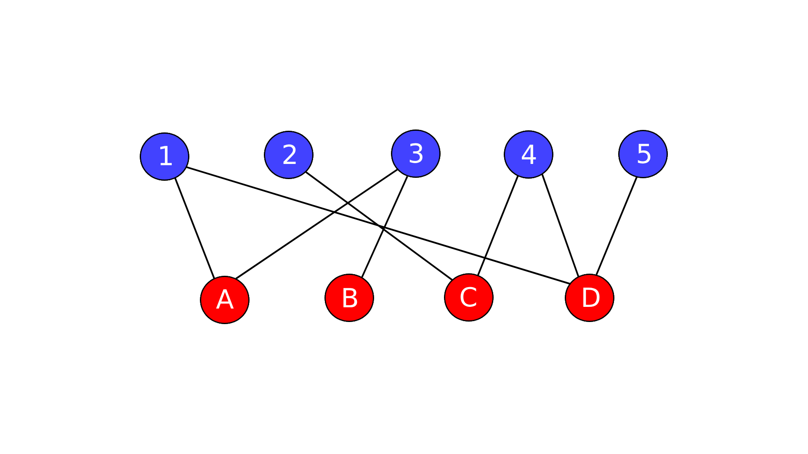

# Project Verity

A graph-based credibility inference system for networks of conflicting claims.

As AI systems increasingly make decisions and complete tasks autonomously using information gathered from across the web, determining which claims are most credible becomes increasingly important.

# Problem

Sources frequently copy each other, causing incorrect claims to propagate across the web. Verity models the relationship between sources and claims as a graph to estimate the credibility of every source and the confidence of every claim it asserts.

# Core Challenge

Source credibility and claim credibility depend on each other recursively.

A source becomes credible if it consistently supports true claims.
A claim becomes credible if it is supported by credible sources.

# Approach

Sources and claims form a bipartite graph. Each edge represents a source asserting a claim about a product spec. Verity treats the dataset as a network rather than a collection of independent observations.

  

  <em>Claims (blue) are asserted by sources (red). Each edge represents one assertion.</em>

The idea is to see whether credibility can emerge naturally through repeated movement across the graph.

You can think of it as a verifier traveling at random: starting on one source then moving to the set of claims it asserts, then from those claims to it's other supporting sources, over and over again. Sources that consistently connect to credible claims will get revisited more often. Claims supported by credible sources also get revisited more often.

However, the underlying framework is not specific to e-commerce. Any domain involving sources, claims, and disagreement can potentially be modeled using the same graph structure.

# Stack

- Python (crawler + scraper)
- SQLite (data storage)

# Current Status of Verity

- Prototype in development
  
- Retailer, manufacturer, and government source ingestion
  
- Approximately 275-300 products indexed, 6 subcategories in electronics and home appliances (Laptops, Headphones, Portable Chargers/Banks, Air Fryers, Espresso Machines, and Mini Fridges)
  
- Sources include Amazon, Walmart, Target, Best Buy, Home Depot, Apple, and more
  
- 15,000+ extracted claims (soon to be many more!)
