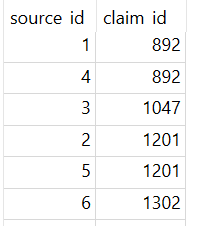
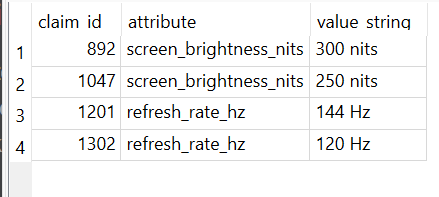

# Example Walkthrough

Suppose several sources publish specifications about the same laptop display.

One group of sources asserts:

- screen_brightness_nits = 300 nits

while another source asserts:

- screen_brightness_nits = 250 nits

Instead of treating these values as isolated rows, the system represents them as graph claims.

Each source forms an edge to the claim it asserts:

source_id -> claim_id

This creates a structure where:
- sources connect to claims
- claims accumulate support from multiple sources
- conflicting claims compete for reinforcement

In the above images,

- claim 892 = screen_brightness_nits : 300 nits
- claim 1047 = screen_brightness_nits : 250 nits

If multiple independent sources support claim 892, the graph may repeatedly revisit that region during recursive propagation.

However, agreement alone does not necessarily imply independence.

If several sources inherit the same upstream specification, reinforcement may emerge from correlated structure rather than truly independent verification.

This is one reason the graph topology itself may contain important credibility signals.
