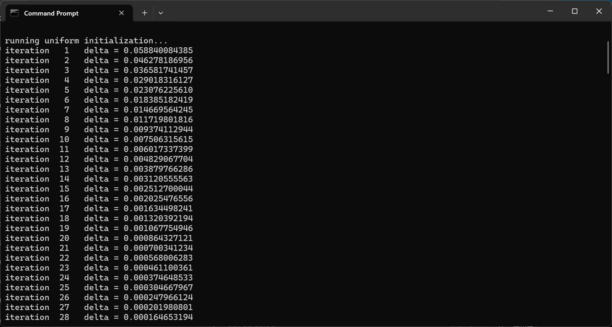
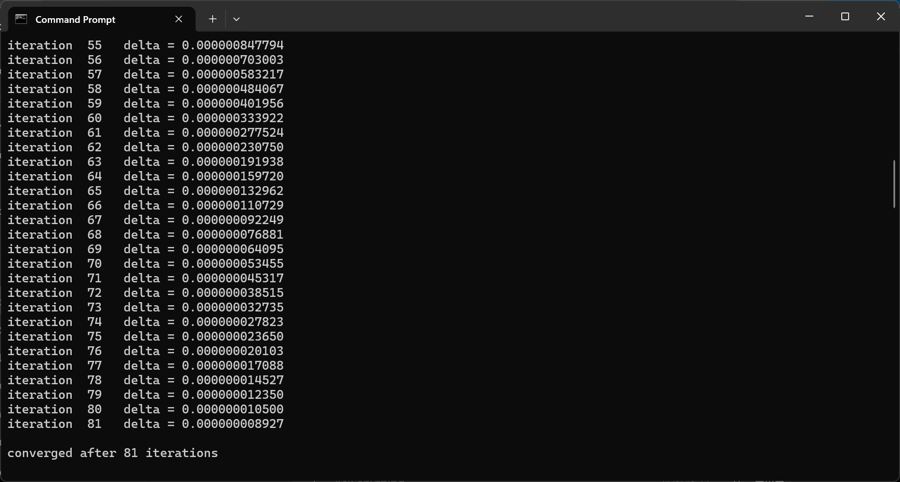
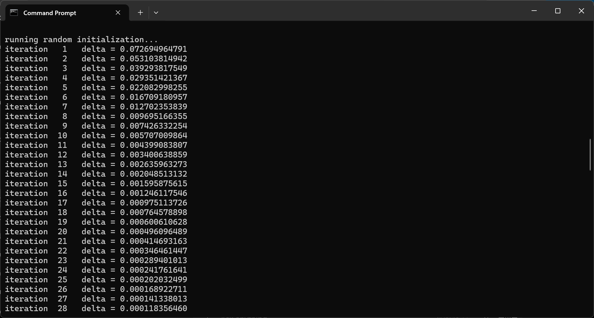
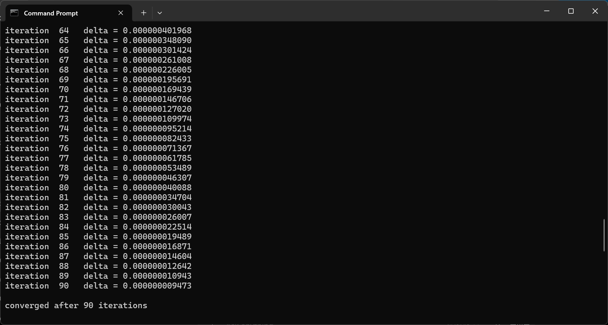
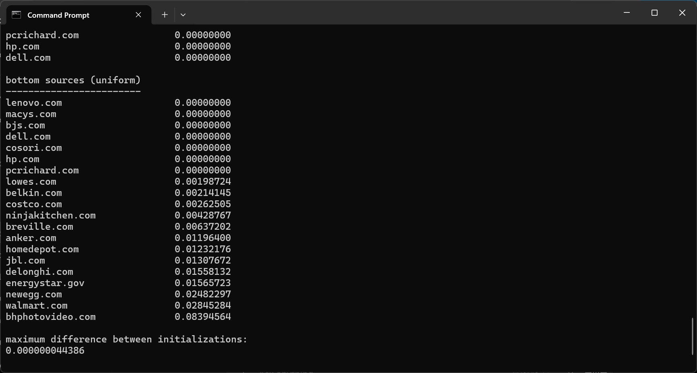
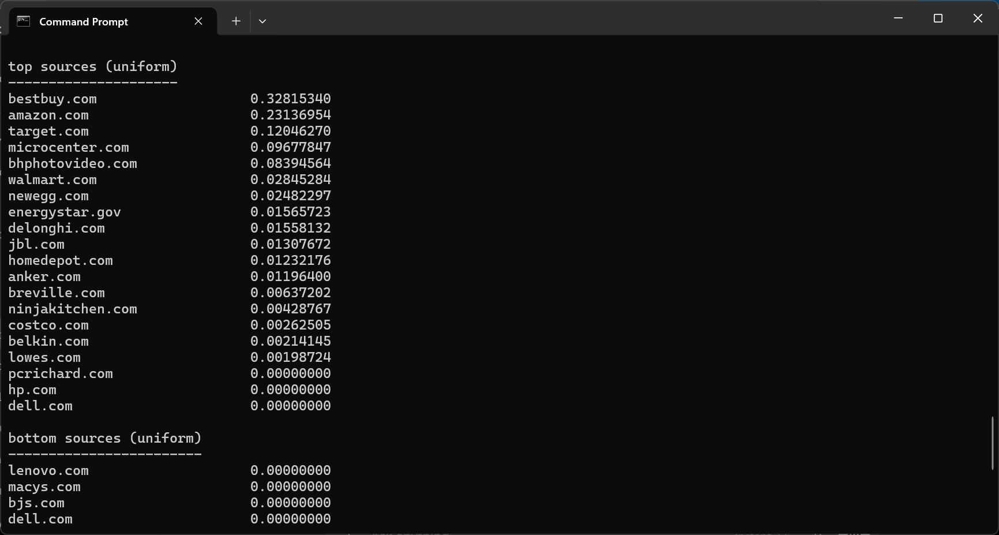

# Experiment 5 - Bidirectional Normalization

**Date:** June 14, 2026

Experiment 4 demonstrated the graph consistently converges to a fixed point for both uniform and random initialization.

I've noted that the ranking results revealed a hidden problem. Even after source degree normalization, some sources are still capable of consuming all credibility due to the graph structure.

To address this we introduce normalization on both sides of the bipartite graph.

## Previous propagation

The original propagation step allows for distribution of source credibility across the claims asserted by each source:

$$
q_j = \sum_i \frac{s_i}{d_i}
$$

where:

* $(s_i)$ = source credibility

* $(d_i)$ = number of claims made by source $(i)$

The claims then vote back onto sources:

$$
s_i' = \frac{1}{|C_i|}\sum_j q_j
$$

After each iteration we normalize:

$$
\sum_i s_i = 1
$$

## Bidirectional normalization

In v4 we additionally normalize claim support by the number of supporting sources:

$$
q_j = \frac{1}{|S_j|}\sum_i \frac{s_i}{d_i}
$$

where:

* $(|S_j|)$ = number of sources supporting claim $(j)$

The idea is simple: if many sources contribute to the same claim, we average that support instead of allowing it to accumulate indefinitely.

## Current graph

* 24 sources

* 12,684 claims

* 13,860 assertions

*Current graph statistics used in Experiment 5.*

Average sources per claim:

$$
1.09
$$

Average sources per product:

$$
2.02
$$

Products by number of sources:

* 155 products with 1 source

* 77 products with 2 sources

* 56 products with 3 sources

* 29 products with 4 sources

* 13 products with 5 sources

* 2 products with 6 sources

## Results

*Early iterations under uniform initialization.*

Both initialization schemes converged:

* Uniform initialization: 81 iterations

*Uniform initialization converged after 81 iterations.*

* Random initialization: 90 iterations

*Early iterations under random initialization.*

*Random initialization converged after 90 iterations.*

Maximum difference between final solutions:

$$
4.44 \times 10^{-8}
$$

*The final solutions from uniform and random initialization differed by less than 4.44 × 10^-8.*

The resulting rankings were evidently more balanced than in previous experiments.

Top sources:

1. bestbuy.com — 0.328
2. amazon.com — 0.231
3. target.com — 0.120
4. microcenter.com — 0.097
5. bhphotovideo.com — 0.084

*Bidirectional normalization produced much more balanced source rankings than previous experiments.*

## Current observations

The propagation scheme appears more stable now.

Most claims are still asserted by only a single source:

$$
\text{Average sources per claim} \approx 1.09
$$

This means the graph still contains little agreement information for credibility propagation.

Improving product matching and claim canonicalization may have a more noticeable impact than further changes to the propagation algorithm itself. Increasing overlap between sources may be the largest improvement going forward. Although, additional experiments are needed to separate the effects of graph structure from the propagation operator itself.
