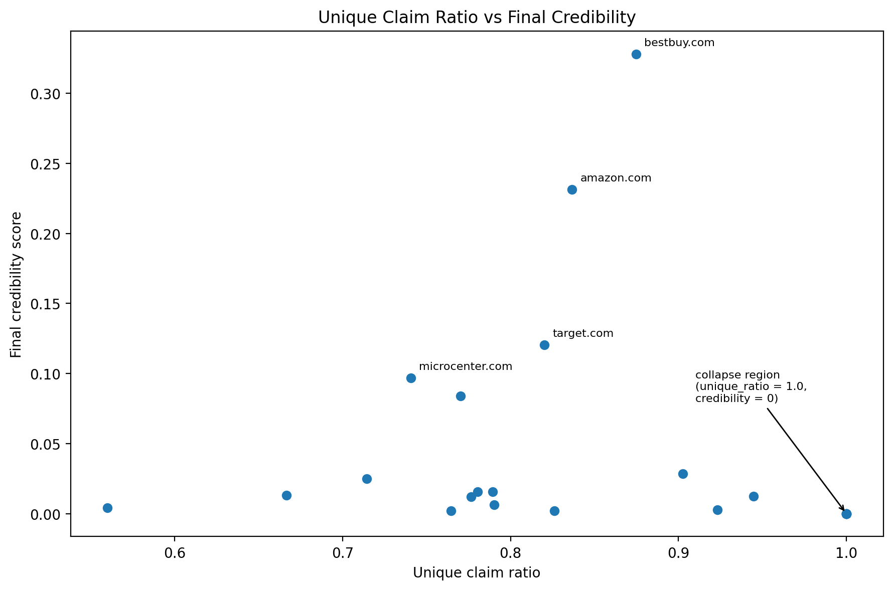

# Experiment 6 - Unique Claim Collapse

Date: June 16, 2026

Something odd happened with the final source credibility rankings. Several sources ended up having zero credibility for them to merge.

- lenovo.com
- pcrichard.com
- hp.com
- macys.com
- cosori.com
- dell.com
- bjs.com
  
At first, I assumed the propagation algorithm was buggy because the zeros seemed a bit too perfect. But after reviewing the graph at the end for claim support, a noticeable pattern formed.

For each source, I calculated:

unique_ratio =
(unique claims made by source) /
(claims made by source)

where unique claim means a claim made by only 1 source.

Here is a sampling:

```text
lenovo.com 57 / 57 unique claims (1.0000)
pcrichard.com 50 / 50 unique claims (1.0000)
hp.com 47 / 47 unique claims (1.0000)
macys.com 23 / 23 unique claims (1.0000)
cosori.com 12 / 12 unique claims (1.0000)
dell.com 12 / 12 unique claims (1.0000)
bjs.com 10 / 10 unique claims (1.0000)
```
compared to:
```
ninjakitchen.com 14 / 25 unique claims (0.5600)
jbl.com 28 / 42 unique claims (0.6667)
microcenter.com 511 / 690 unique claims (0.7406)
amazon.com 2526 / 3019 unique claims (0.8367)
bestbuy.com 4615 / 5276 unique claims (0.8747)
```
Every single source that dropped to zero also happened to have a unique ratio of exactly 1.0.

Below is a plot of the unique claim ratio vs. Final credibility of each source:



The relation isn't quite linear, there's still a decent amount of sources that get high unique ratios but still good credibility. However, every source with a unique ratio of exactly 1.0 was dropped to zero.

I also calculated correlation of unique claim ratio and final credibility:

correlation = -0.1154

I thought it would be stronger than this.
So the relationship isn't just:

more unique claims => lower credibility

It may be that the really weird point is the limit. Sources with high unique ratios but who are not fully disconnected can still maintain credibility by sticking close to the graph. However if the unique ratio is exactly 1.0 it seems to die.
It looks like it is isolation that really matters, not the unique ratio in itself.

Why?

It seems that without any other source to vouch for it (on this graph, at least) unsupported claims can't seem to climb back up.

Source -> claim -> source

This highlights a more fundamental question: are we penalizing false claims or only isolated ones? A unique claim isn't always incorrect, it could be a newly discovered piece of information. Meanwhile, a widely reported claim isn't necessarily correct.

The four cases that this suggests are:
- shared truth
- shared falsehood
- unique truth
- unique falsehood
  
The graph measures agreement. Independence is not measured yet.

How do we measure if one source has been copying another? The system will need to be able to identify similar sources and their connection to the outlier sources.
