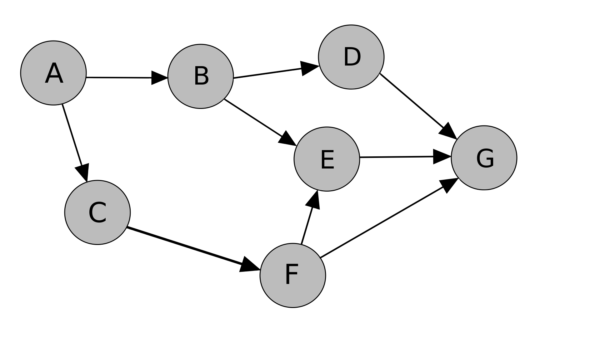

# Structural Source Dependencies

If two sources agree, it does not necessarily mean that they are independent.

The same claim may be asserted by two independent sources because they both independently arrived at the same information.

Alternatively, the same claim may be asserted by two dependent sources based on one copying the other.

From the perspective of a credibility propagation algorithm, these two instances appear identical despite the different evidence.

As a consequence, a large number of dependent sources can create an illusion of high consensus despite a lack of independent evidence. In contrast, a small number of independent sources can contribute greater evidence than a large number of sources with copied information.

## Research Question

Can we extract structural signals relating to source dependencies exclusively from the source-claim graph?

## Hypothesis

Let's suppose Source B depends on Source A.

In that case, the information asserted by Source B should typically be more completely contained within the information asserted by Source A than vice versa.

This directional asymmetry of the relationship could, perhaps, be a useful structural signal relating to source dependencies that does not require introducing explicit citation or provenance metadata.

<p align="center">
  
</p>

## Thought Experiments

First, let's test the ability of directional inclusion asymmetry to distinguish source dependencies from independent agreement based only on the graph structure. There are a couple different potential cases:

### Case 1 - Perfect Copying

Source A:

{1, 2, 3, 4, 5}

Source B:

{1, 2, 3, 4, 5}

Expected outcome:

- The two sources appear structurally identical.
- A dependency likely exists.
- The direction of the dependency cannot be determined from graph structure alone.
- The graph cannot distinguish between:
  - Source A copied Source B.
  - Source B copied Source A.
  - Both copied a hidden third source.

### Case 2: Partial Copying

Source A:

{1, 2, 3, 4, 5}

Source B:

{1, 2, 3}

Expected outcome:

- All of Source B's assertions have been made by Source A too.
- Source B is a proper subset of Source A.
- Source A only partially explains Source B in the reverse order.
- This is why directional asymmetry occurs and supports the hypothesis.

### Case 3: Independent Agreement

Source A:

{1, 2, 3, 4, 5}

Source B:

{2, 4, 6, 8}

Expected outcome:

- There is agreement present between the two independent sources on some claims.
- The hypothesis cannot conclude a dependency relationship that does not exist.
- Graph alone may or may not distinguish this case; it is yet to be determined.

### Case 4: Common Upstream Source

Source C:

{1, 2, 3, 4, 5}

Source A:

{1, 2, 3}

Source B:

{1, 2, 4}

Expected outcome:

- Information on both sources roots from a common upstream source.
- None of the sources depend on each other.
- In cases where Source C is not in the graph, this scenario cannot be distinguished from copying.
- This is one of the limitations of a graph-based method.

## Directional Inclusion Asymmetry (Experiment 1)

One of the things I wanted to see right away was if directional inclusion itself contains any structural signal without parameters.

To do that, I constructed for each source the set of assertions:

(product, attribute, value)

and measured between all pairs of sources:

- matching assertions
- conflicting assertions
- directional inclusion
- agreement ratio
- asymmetry

After computing the top-ranked pairs, I wrote an inspection tool to manually compare all matching and conflicting assertions between the two sources.

In addition, it became clear after analyzing the shared assertions that the disagreements were not random, but rather, were conflicting specifications for the same product.

### Results

A number of high-ranking source pairs quickly seemed to make sense.

For instance, there was a higher percentage of claims made by Target that were included in Best Buy than vice versa.

In looking at the source pairs, we found that disagreement was usually a conflicting value of the same product rather than an independent assertion.

This indicates that directional inclusion is more than just agreement. It also accounts for the extent to which one source’s information is structurally included in another’s.

### Observations

Directional inclusion asymmetry seems to provide a meaningful structural signal describing relationships between sources.

On the other hand, it does not completely solve the problem.

A perfect copy cannot be distinguished from a hidden common parent source, and very small sources can lead to overinflated asymmetry scores.

The next step is to figure out whether directional inclusion should be treated as one of many structural features contributing to estimating source dependencies.

## Rarity of Shared Assertions (Experiment 2)

Directional inclusion asymmetry quantifies how much one source's information is completely contained within another's. But, it also treats each shared assertion equally regardless of how common that assertion is throughout the graph.

To see if more structural information can be extracted, I decided to compute a rarity-weighted overlap score between every pair of sources.

What this means is that assertions shared by fewer sources contribute more to the overall score, while assertions that are common contribute less.

### Results

The rankings results differed from those produced by raw overlap counts alone. Source pairs that were relatively close in amount of shared assertions sometimes received noticeably different rarity scores. This ultimately depended on how uncommon those shared assertions were throughout the graph.

That said, rarity-weighted overlap seems to capture a structural property beyond simple agreement.

### Observations

This experiment does not mean rarity-weighted overlap is a measure of source dependency all by itself. Instead, it explains that when estimating the structural relationship among sources, uncommon shared assertions might provide additional evidence beyond raw overlap.

Rarity-weighted overlap seems to be a promising candidate as part of the broader hybrid dependency model introduced earlier. Nonetheless, whether it holds up alongside other structural signals or not is an empirical question for further experiments.

## Manual Implementation Validation

I manually reproduced the dependency score for one source pair, Best Buy and Target, in order to determine if the implementation matched the mathematical definition.

The implementation reported:

```text
Assertions from Best Buy: 792
Assertions from Target:   314

Matching assertions:      198
Conflicting assertions:    34

Average rarity:           0.421633
```

We compute directional inclusion as:

$$
\max\left(\frac{198}{314}, \frac{198}{792}\right) = 0.630573
$$

We then compute the redundancy score as:

$$
0.630573 \times 0.421633 = 0.265870
$$

Finally, we compute the structural independence score as:

$$
1 - 0.265870 = 0.734130
$$

The manually computed values matched the implementation output precisely. The inspection tool also independently counted the same 198 matching assertions and 34 conflicting assertions as the production implementation.

## Community Overlap (Experiment 3)

The first two experiments centered on measuring each pair of source's structural relationship.

I also wanted to figure out if an additional dependency signal could be derived from the larger graph structure that isn't pairwise connections.

I constructed a weighted source graph where each edge is the number of assertions shared between two sources to test this. Then, using the Louvain algorithm, community detection was performed.

### Results

The algorithm divided the graph into coherent groups of related sources but preserved several strong connections between different communities.

After inspecting the bridge edges, I noticed that, despite belonging to different clusters, some sources maintained substantial relationships outside their assigned community.

### Observations

Overall, community detection seems to not introduce any independent structural signal and just summarizes the existing overlap graph.

Unlike directional inclusion asymmetry and rarity-weighted overlap, which quantify distinct properties of the relationship between two sources, community membership is derived directly from those same overlap relationships.

This experiment showed that community detection does not contribute any meaningful additional information for estimating source dependencies beyond the pairwise measures already considered. Nonetheless, it was still useful and suggests that it may be more effective for graph analysis / visualization, not a core component of a dependency model.

## Conclusion

Upon experiments, we have demonstrated that directional asymmetry inclusion can derive meaningful structural information from the source-claim graph. Likewise, rarity-weighted overlap managed to capture a distinct structural property beyond simple agreement. These experiments have indicated that useful evidence regarding relationships between sources can be found from the graph topology.

However, that being said, the experiments also revealed several fundamental ambiguities. Particularly the fact that graph structure alone cannot distinguish copying from a hidden source upstream, nor can it fully identify dependency relationships in all cases.

Overall though, these results do suggest that while structural graph signals can be valuable, it is insufficient to determine source dependencies on its own. Instead, I believe these structural graph-based features can serve as a foundation combined with provenance and metadata in order to estimate source dependencies more effectively and accurately.